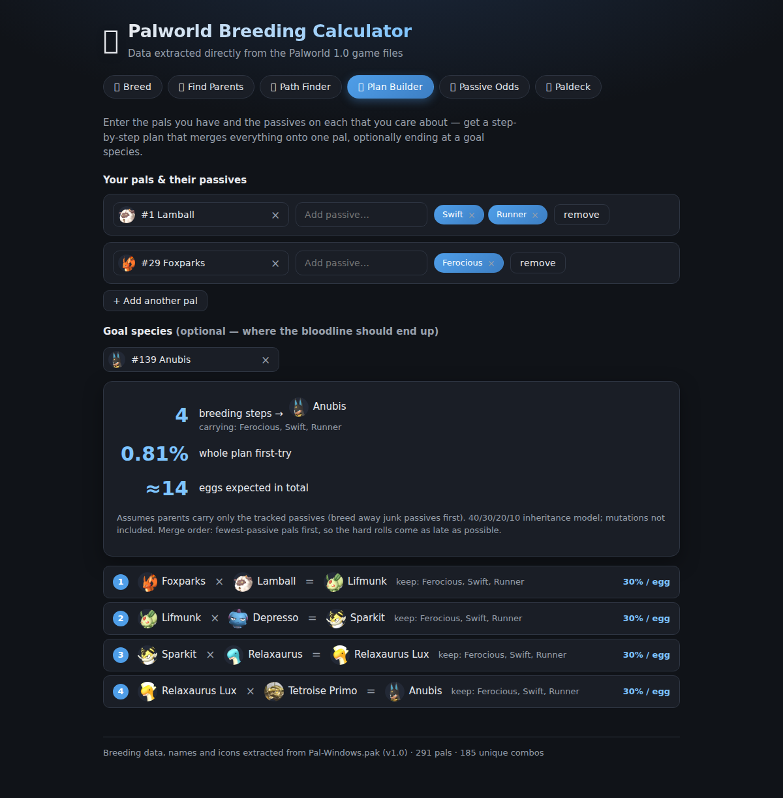

# 🥚 Palworld 1.0 Breeding Calculator

A fast, single-file breeding calculator for **Palworld 1.0**, with every number pulled
**directly from the game files** - not from stale community spreadsheets. When Pocketpair
ships a patch, one command re-extracts everything.

**291 pals · 185 unique combos · real 1.0 breeding powers · in-game icons**


## ✨ No install - just open it

Download **[`Palworld Breeding Calculator.html`](Palworld%20Breeding%20Calculator.html)**
and double-click it. That's the whole app: every pal, icon, and formula is bundled into one
portable HTML file (~1.4 MB). Works offline, no server, no tracking.

## What it does

| Tab | What you get |
|---|---|
| 🥚 **Breed** | Pick two parents → see the exact child, as a visual equation |
| 🎯 **Find Parents** | Pick a target → every parent pair that produces it, sortable by rarity/element/name |
| 🗺️ **Path Finder** | Shortest breeding chain to a goal pal - from one pal (paldb-style, wild partners allowed) or restricted to pals you own - with passive carry-through odds |
| 🧬 **Plan Builder** | Enter several pals + the passives on each → a full step-by-step plan that merges everything onto one bloodline and ends at your goal species, with per-egg odds and expected egg counts |
| ✨ **Passive Odds** | Inheritance probability for any desired passive set |
| 📜 **Passive Skills** | Every pal passive with its in-game description, searchable, sortable by tier or name |
| 🌍 **Spawn Map** | Full-page interactive map - pick any of the 259 spawnable pals from the list and see exactly where it spawns, on the world or World Tree map |
| 📖 **Paldeck** | Browse all 291 pals - sort by number, name, rarity, element, breeding power; filter by element |

Every pal shown anywhere is **clickable** - a detail popup shows its stats, unique combos,
and shortcuts into the other tools, with back/close returning you exactly where you were.
The popup also has a **📍 Spawn map** (the same map view as the Spawn Map tab): the
world map with the pal's actual day/night habitat areas drawn on it, straight from the
game's own Paldeck distribution data (`DT_PaldexDistributionData`). It supports
scroll-wheel zoom anchored at the cursor with drag panning, fullscreen, day/night
toggles with customizable highlight colors, live in-game coordinates under the cursor,
the spawn-area center coordinates, and a separate World Tree map for the 41 pals that
spawn there. Pals that never spawn wild (legendaries, breed-only variants) say so
instead.





## How breeding works in 1.0 (as datamined)

- Same species always breeds true.
- The 258-row `DT_PalCombiUnique` table overrides everything - including self×self locks
  for legendaries and two gender-specific combos (Katress × Wixen, both directions).
- Otherwise: child rank = `floor((rankA + rankB + 1) / 2)`, and the child is the breedable
  pal (`IgnoreCombi = false`) with the closest `CombiRank`; ties break by lower
  `CombiDuplicatePriority`, then table order.
- Passive odds use the community-datamined model: the child rolls 1-4 passives from the
  parents' combined pool at 40/30/20/10%. Random mutations aren't modeled.

## Run from source

```sh
cd web
npm install
npm run dev        # dev server
npm run build      # production build → dist/index.html (fully self-contained)
```

The app is React + Vite + TypeScript with zero runtime dependencies beyond React. The
single-file build comes from `vite-plugin-singlefile` - copy `dist/index.html` wherever
you like.

## Updating after a game patch - automatic

One command. It finds your Palworld install (Steam library auto-detection, Windows and
WSL), reads the installed version (Steam buildid), and regenerates everything only when
the game actually changed:

```sh
python3 tools/update.py
```

- Game unchanged → prints `game unchanged - nothing to do` and exits.
- Game updated → downloads [repak](https://github.com/trumank/repak) and the current
  community [`Mappings.usmap`](https://github.com/PalworldModding/UsefulFiles)
  automatically, extracts the DataTables and icons from the pak, exports and transforms
  the data, rebuilds the web app, and refreshes `Palworld Breeding Calculator.html`.

Requirements: Python 3, [.NET 10 SDK](https://dotnet.microsoft.com/download), Node.js.

Useful flags:

```sh
python3 tools/update.py --check                 # just report whether an update is needed
python3 tools/update.py --force                 # regenerate even if unchanged
python3 tools/update.py --game-dir "D:/SteamLibrary/steamapps/common/Palworld"
```

The detected game path is remembered in `tools/.gamepath`; the installed version stamp
lives in `data/version.json`. The repo ships with freshly extracted 1.0 data already in
place, so you only run this after a patch.

<details>
<summary><b>Manual pipeline</b> (what update.py does under the hood)</summary>

```sh
# 1. extract DataTables + icons
repak unpack -o extracted \
  -i "Pal/Content/Pal/DataTable/Character" \
  -i "Pal/Content/Pal/DataTable/PassiveSkill" \
  -i "Pal/Content/L10N/en/Pal/DataTable/Text" \
  -i "Pal/Content/Pal/Texture/PalIcon/Normal" \
  "<Palworld install>/Pal/Content/Paks/Pal-Windows.pak"

# 2. export to JSON + decode icons (needs Mappings.usmap)
dotnet run --project tools/exporter -- extracted Mappings.usmap data/raw

# 3. transform into the app dataset
python3 tools/transform.py data/raw web/src/data

# 4. rebuild
cd web && npm install && npm run build
cp dist/index.html "../Palworld Breeding Calculator.html"
```

</details>

## Repository layout

```
Palworld Breeding Calculator.html   ← the app, ready to open
web/                                ← React + Vite source
  src/lib/breeding.ts               ← breeding formula, path finder, bloodline planner
  src/lib/passives.ts               ← passive inheritance math
  src/data/                         ← generated dataset (pals, combos, passives, icons,
                                       spawn maps, world map)
tools/
  update.py                         ← auto-detects game patches, regenerates everything
  exporter/                         ← C# CUE4Parse DataTable + icon exporter
  transform.py                      ← raw JSON → app dataset
data/raw/                           ← DataTable JSON exports from the 1.0 pak
data/version.json                   ← installed game version stamp (patch detection)
```

## Disclaimer

Palworld and all pal names, icons, and game data are © Pocketpair, Inc. This is an
unofficial fan-made tool for personal use, not affiliated with or endorsed by Pocketpair.
Game data is extracted locally from your own legally owned copy.

Code is MIT-licensed - see [LICENSE](LICENSE).
