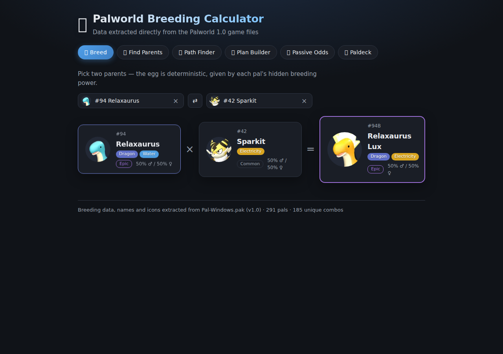
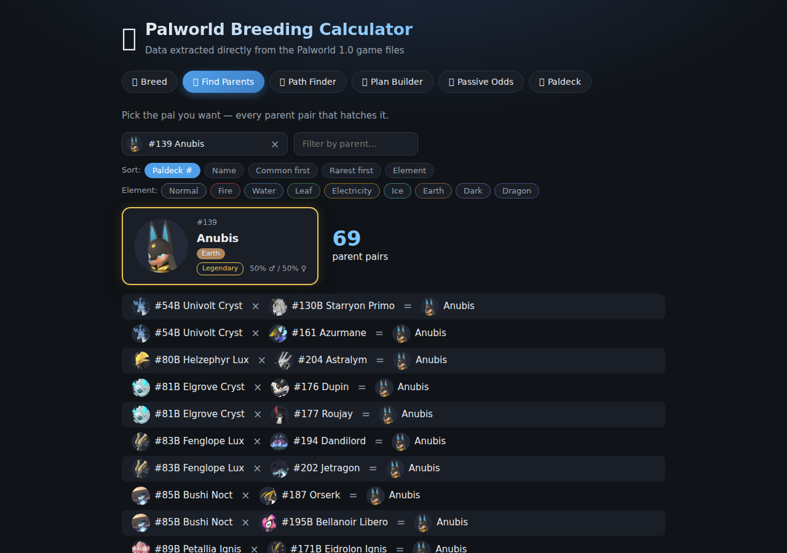
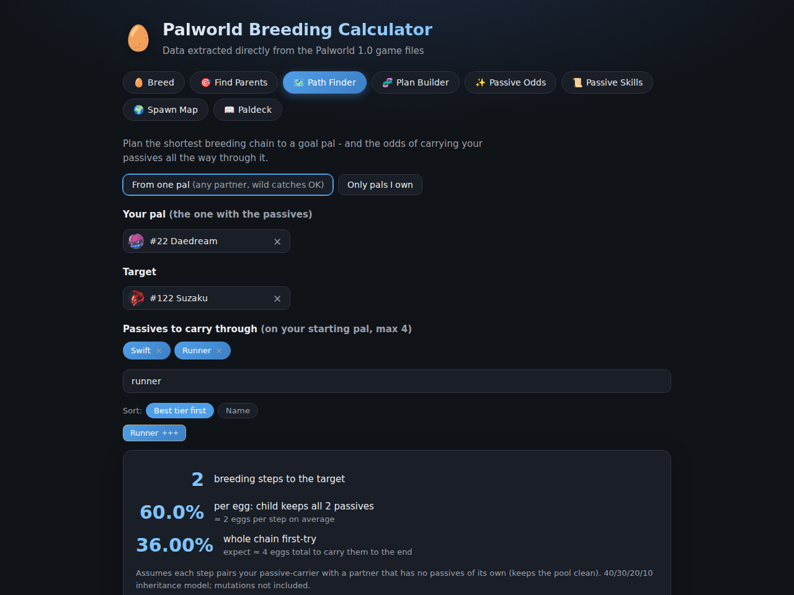
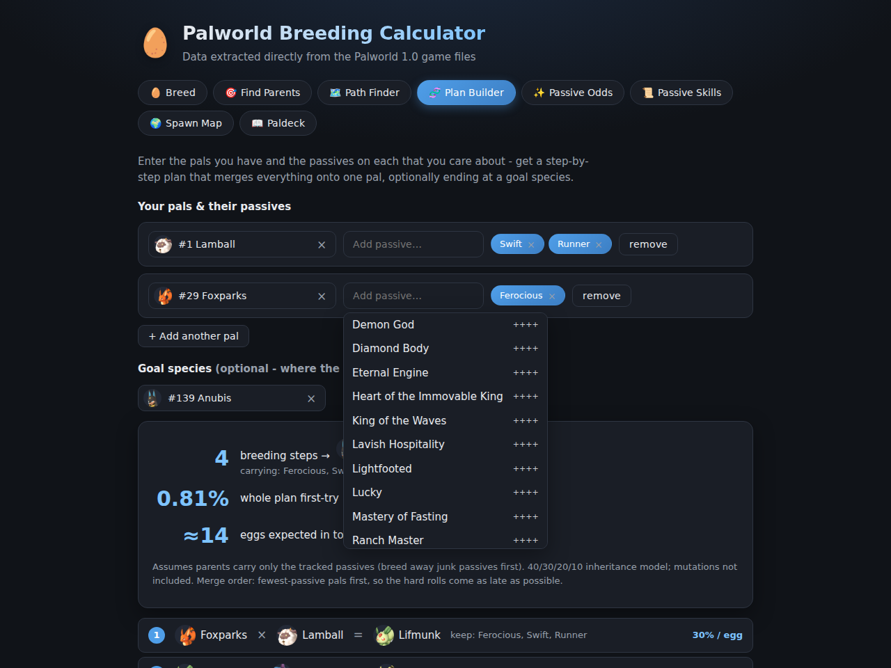
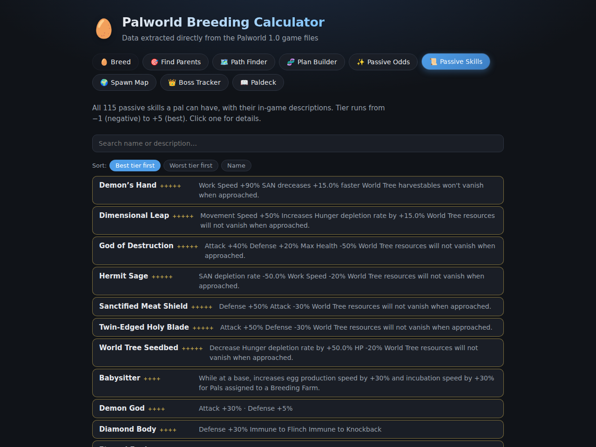
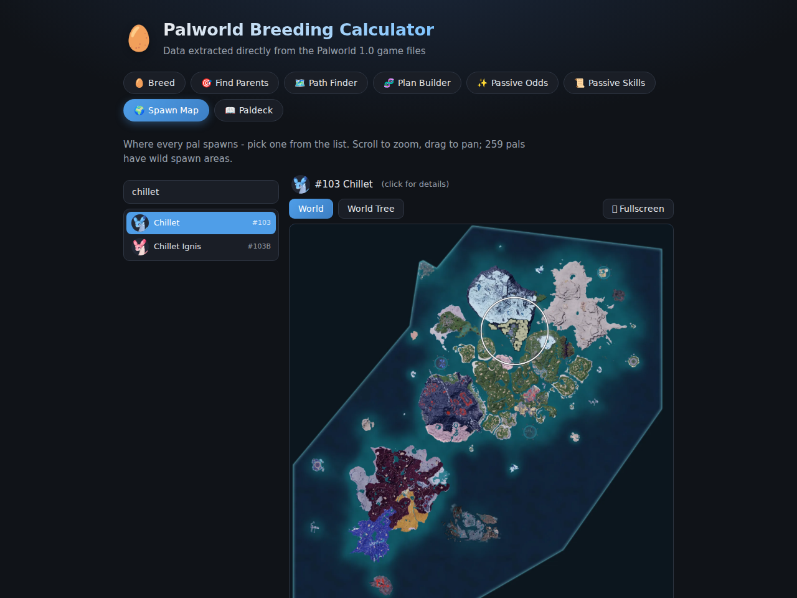
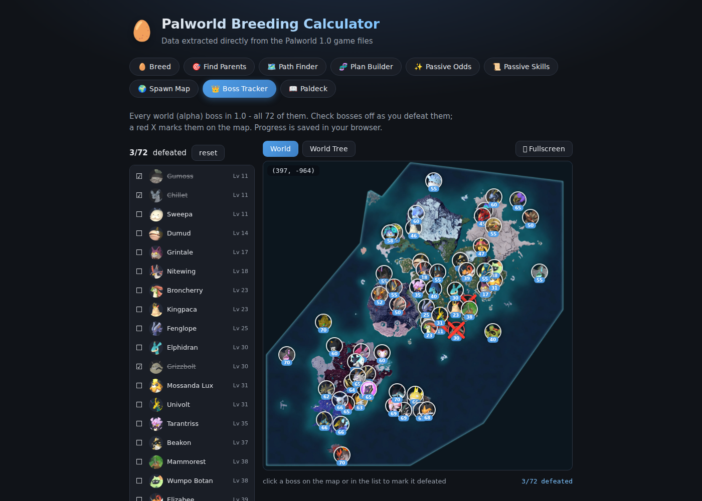
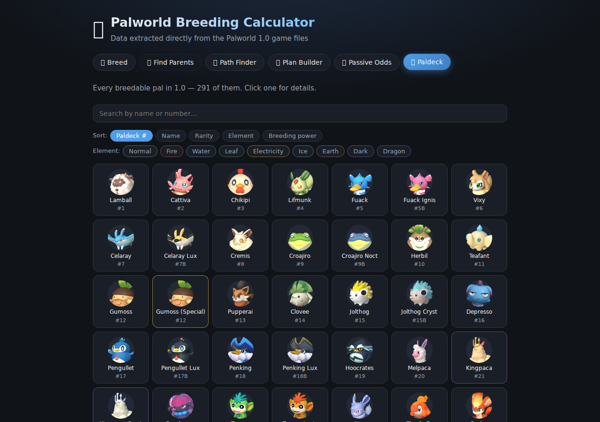
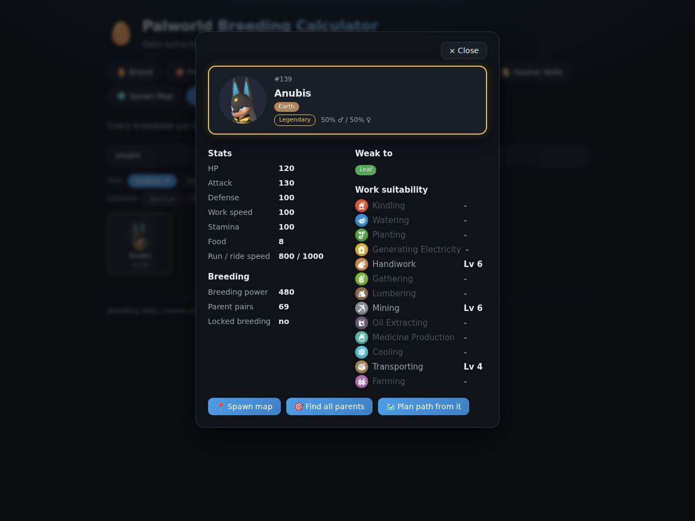

# 🥚 Palworld 1.0 Breeding Calculator

A fast, single-file breeding calculator and complete pal toolbox for **Palworld 1.0**,
with every number pulled **directly from the game files** - not from stale community
spreadsheets. When Pocketpair ships a patch, one command detects it and re-extracts
everything.

**9 tools · 291 pals · 185 unique combos · 115 passives · 72 world bosses · ~150k spawn points · in-game icons and maps**

## ✨ No install - just open it

Download **[`Palworld Breeding Calculator.html`](Palworld%20Breeding%20Calculator.html)**
and double-click it. That's the entire app: every pal, icon, map, and formula bundled
into one portable HTML file. Works offline, no server, no tracking.

---

## 🥚 Breed

Pick two parents and watch the egg resolve as a visual equation - rarity-colored cards,
element chips, gender odds. Handles every 1.0 rule: unique combos, legendary self-locks,
and the two gender-dependent pairs (Katress × Wixen both ways).



## 🎯 Find Parents

Pick the pal you want and see every parent pair that hatches it (Anubis has 69). Sort by
Paldeck number, name, common-parents-first, rarest-first, or element - and filter with
element chips or a name search.



## 🗺️ Path Finder

The shortest breeding chain to any goal:

- **From one pal** - any partner allowed (wild catches assumed), every step listing the
  partner to use plus how many alternatives would also work
- **Only pals I own** - restricted to your box, with alternative final pairings

Tag up to 4 passives to carry through the chain and get per-egg keep odds, whole-chain
first-try probability, and expected egg totals.



## 🧬 Plan Builder

The multi-pal planner. Enter several pals and the passives on each, pick an optional goal
species, and get a complete step-by-step plan that merges every tracked passive onto one
bloodline and walks it to the goal - cheapest merges first so the hard rolls come late,
with per-egg odds and expected egg counts for the whole operation.



## ✨ Passive Odds

Mark the passives the two parents share, mark the ones you want on the child, and get
the exact inheritance probability (at-least and exact-set) plus expected eggs, using the
datamined 40/30/20/10 model.

## 📜 Passive Skills

All 115 passives a pal can have, with real in-game descriptions and tier badges (-1 up
to the +5 World Tree passives) - including the innate ones like Legend, the element
Emperor and Lord set, and mutation pal passives. Search, sort by tier or name, and click
any skill for a detail view: effect breakdown, wild roll chance computed from the game's
lottery weights, and sourcing (lottery, lucky-only, or innate/special).



## 🌍 Spawn Map

Where every pal actually spawns, from the game's own Paldeck distribution data - the same
~150k coordinates the in-game habitat map uses, drawn on the real 1.0 world map texture:

- Glowing **attention rings** around every spawn cluster, so tiny habitats are unmissable
- **Day / night** areas in customizable colors (overlap auto-blends)
- Scroll-wheel **zoom** anchored at the cursor, drag panning, **fullscreen**
- Live **in-game coordinates** under the crosshair, plus a **best spot** readout at the
  center of the densest cluster
- A separate **World Tree** map for the 41 pals that spawn there (World-Tree-only pals
  flagged 🌳)



## 👑 Boss Tracker

All 72 world (alpha) bosses from the game's spawner tables, each marked on the map with
its portrait and level. Click a boss on the map or in the list to check it off - defeated
bosses get a red X and a struck-through list entry, with a running progress counter.
Progress persists in your browser, works on both the world and World Tree maps, and the
full zoom / pan / fullscreen kit carries over.



## 📖 Paldeck

All 291 pals in a rarity-framed grid - gold legendaries, pink mythics. Sort by number,
name, rarity, element, or breeding power; filter by element.



## Everything is clickable

Any pal shown anywhere opens a full detail popup - and details stack with a Back button,
so you can wander and always find your way back to what you were doing:

- Base **stats** (HP, attack, defense, work speed, stamina, food, run/ride, nocturnal)
- **Elemental weakness** from the type chart
- All 13 **work suitabilities** with the game's own colored icons and levels
- **Breeding** info: power, parent-pair count, locks, self-breed result, unique combos
- Its own **spawn map**, an image lightbox on the portrait, and shortcuts into
  Find Parents and Path Finder



---

## How breeding works in 1.0 (as datamined)

- Same species always breeds true.
- The 258-row `DT_PalCombiUnique` table overrides everything - including self×self locks
  for legendaries and two gender-specific combos (Katress × Wixen, both directions).
- Otherwise: child rank = `floor((rankA + rankB + 1) / 2)`, and the child is the breedable
  pal (`IgnoreCombi = false`) with the closest `CombiRank`; ties break by lower
  `CombiDuplicatePriority`, then table order.
- Passive odds use the community-datamined model: the child rolls 1-4 passives from the
  parents' combined pool at 40/30/20/10%. Random mutations aren't modeled.

## Run from source

```sh
cd web
npm install
npm run dev        # dev server
npm run build      # production build → dist/index.html (fully self-contained)
```

React + Vite + TypeScript, zero runtime dependencies beyond React. The single-file build
comes from `vite-plugin-singlefile` with all assets inlined - copy `dist/index.html`
wherever you like.

## Updating after a game patch - automatic

One command. It finds your Palworld install (Steam library auto-detection, Windows and
WSL), reads the installed version (Steam buildid), and regenerates everything only when
the game actually changed:

```sh
python3 tools/update.py
```

- Game unchanged → prints `game unchanged - nothing to do` and exits.
- Game updated → downloads [repak](https://github.com/trumank/repak) and the current
  community [`Mappings.usmap`](https://github.com/PalworldModding/UsefulFiles)
  automatically, extracts the DataTables, icons, and map textures from the pak, exports
  and transforms the data, rebuilds the web app, and refreshes
  `Palworld Breeding Calculator.html`.

Requirements: Python 3, [.NET 10 SDK](https://dotnet.microsoft.com/download), Node.js.

Useful flags:

```sh
python3 tools/update.py --check                 # just report whether an update is needed
python3 tools/update.py --force                 # regenerate even if unchanged
python3 tools/update.py --game-dir "D:/SteamLibrary/steamapps/common/Palworld"
```

The detected game path is remembered in `tools/.gamepath`; the installed version stamp
lives in `data/version.json`. The repo ships with freshly extracted 1.0 data already in
place, so you only run this after a patch.

<details>
<summary><b>Manual pipeline</b> (what update.py does under the hood)</summary>

```sh
# 1. extract DataTables + icons + map textures
repak unpack -o extracted \
  -i "Pal/Content/Pal/DataTable/Character" \
  -i "Pal/Content/Pal/DataTable/PassiveSkill" \
  -i "Pal/Content/L10N/en/Pal/DataTable/Text" \
  -i "Pal/Content/Pal/Texture/PalIcon/Normal" \
  -i "Pal/Content/Pal/DataTable/UI" \
  -i "Pal/Content/Pal/DataTable/WorldMapUIData" \
  -i "Pal/Content/Pal/Texture/UI/Map" \
  -i "Pal/Content/Pal/Texture/UI/InGame/SkillIcon" \
  -i "Pal/Content/Pal/Texture/UI/IngameMenu/Research/EffectIcon" \
  "<Palworld install>/Pal/Content/Paks/Pal-Windows.pak"

# 2. export to JSON + decode icons and maps (needs Mappings.usmap)
dotnet run --project tools/exporter -- extracted Mappings.usmap data/raw

# 3. transform into the app dataset
python3 tools/transform.py data/raw web/src/data

# 4. rebuild
cd web && npm install && npm run build
cp dist/index.html "../Palworld Breeding Calculator.html"
```

</details>

## Repository layout

```
Palworld Breeding Calculator.html   ← the app, ready to open
web/                                ← React + Vite source
  src/lib/breeding.ts               ← breeding formula, path finder, bloodline planner
  src/lib/passives.ts               ← passive inheritance math
  src/lib/spawns.ts                 ← spawn map decoding + coordinate transforms
  src/data/                         ← generated dataset (pals, combos, passives, icons,
                                       spawn maps, world + World Tree map textures)
tools/
  update.py                         ← auto-detects game patches, regenerates everything
  exporter/                         ← C# CUE4Parse DataTable + texture exporter
  transform.py                      ← raw JSON → app dataset
data/raw/                           ← DataTable JSON exports from the 1.0 pak
data/version.json                   ← installed game version stamp (patch detection)
```

## Disclaimer

Palworld and all pal names, icons, and game data are © Pocketpair, Inc. This is an
unofficial fan-made tool for personal use, not affiliated with or endorsed by Pocketpair.
Game data is extracted locally from your own legally owned copy.

Code is MIT-licensed - see [LICENSE](LICENSE).
